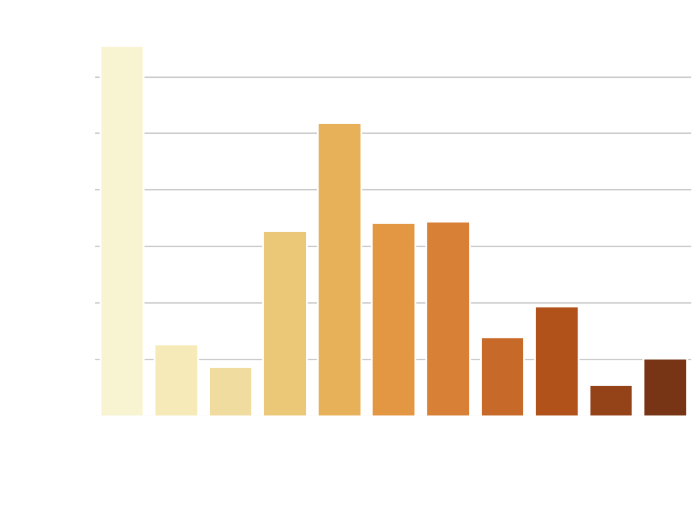
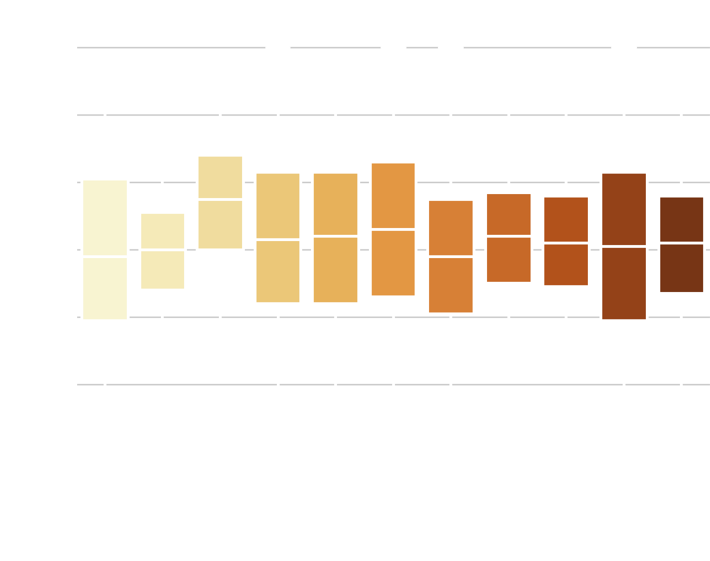
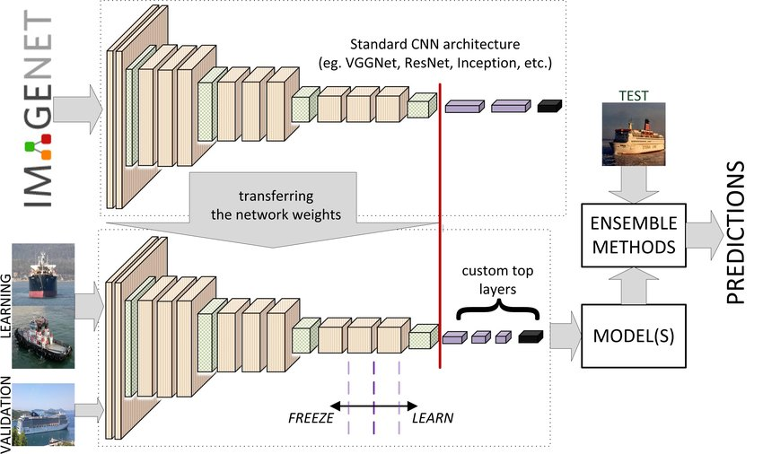
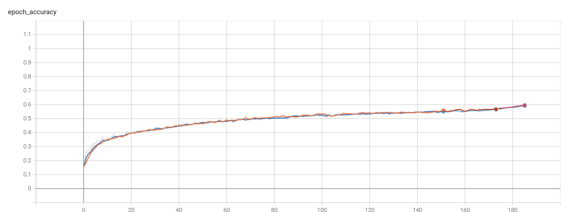
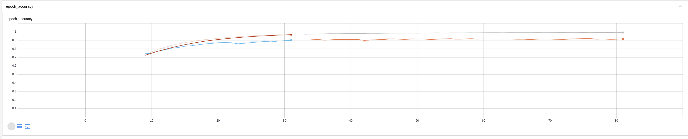
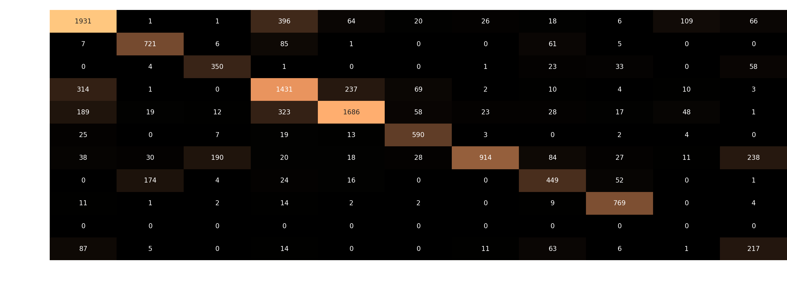
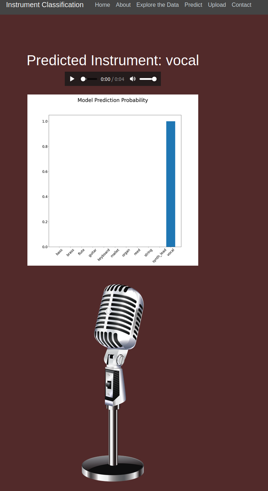

# Instrument Classifier
### Predict Instrument Family from Audio Recording

The goal of this project was to use Transfer Learning in Tensorflow to train a Neural Network to predict instrument family based on audio recordings of the instrument playing a single note. 

### Data
Data was dowloaded from [NSynth](https://magenta.tensorflow.org/nsynth). This model was trained on a a balanced subset (5000 per instrument class, split into 80% training 20% test sets) of the available training set found on the linked site. Validation was performed after training by downloading the validation set.

Classes were balanced by sampling 5000 sounds from each class. This was determined by taking the class that was least represented in the dataset (synth_lead) and using that for the cutoff for the remaining 10 classes.

Evaluation of the sound files showed that the dataset has samples from the entire instrument pitch range. This ensures that the model will be trained on the instrument's tonal properties and not the pitch of the sample. It also ensures that training data will be representitve real-world or validation data.

Using Librosa, WAV files were converted to spectrograms and separated into instrument class folders and saved as PNG images.
Images were not transformed due to the graphical nature of spectrograms. Modifying the images by fitlering, skewing, or blurring as in a traditional image classification network would result in the transformation of the data provided and could inhibit the ability to predict. Having many files to train on made up for the inability to transform.

### Training

Transfer Learning provided a way to load the structure and weights from VGG19 and apply the pre-trained model to the 11 categories in my classification. Initially, traning was performed on top layers only, and layers were incrementally unfrozen until accuracy and loss did not see an improvement.

### AWS Cloud Computing

The model was saved and moved to an AWS EC-2 instance in order to free up local computing power. After training for an additional 40 epochs the model achieved 97% training and 82% test accuracy.

### Validation

Best weights were saved with 92% accuracy on the test split from the initial dataset. The unseen, unbalanced validation set scored 72% accuracy. As expected, overfitting caused the accuracy to drop on unseen data, and the inability to transform limited the amount of training data available.

A confusion matrix shows further insight into the miscategorization of instruments.

### Flask App

Model was deployed using Flask. A website was built around the model to allow a user to explore the original dataset, predict on the data, upload their own audio, and make predictions. The resulting preditcion page will display the model's prediction as well as generate a bar plot to display prediciton confidence. The true instrument being predicted on is also displayed if predicting on the original dataset.

### Conclusion

Classifing audio is a complex, but achievable task with the help of transfer learning. Using spectrograms to describe audio was a successful method with this dataset, but could prove difficult in some other applications. Some data about the audio is lost when converting to spectrograms. Using graphical representation of audio allows for the use of well studied image classification techniques. Transfer learning allows time and resource savings, allowing this project to be completed in a week instead of much longer training times required to train from scratch.

### Future Exploration

Attempt to retain audio data by training on raw audio instead of converting to spectrograms. Assess the prediction accuracy improvement against the additional training time.

Look at more audio focused networks like WaveNet to predict on more than a fixed length time audio sample.

Deep dive on confusion matrix to target the errors in the model and continue to train on more data to assist with the overfitting on the training set.

Research transformation possibilites on spectrograms that would not alter the data.

### Technologies Used
